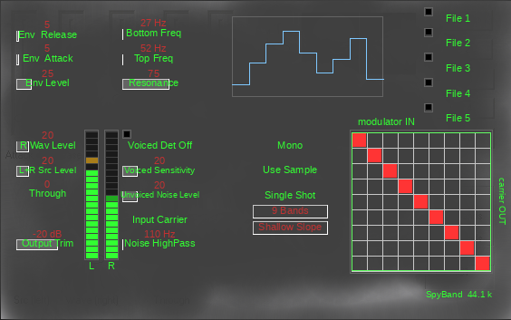

# SpyBand

A band vocoder, ported from the 2004 Cakewalk DXi to VST3 and Audio Unit
for macOS.



It runs the input through a bank of 9, 12, 18 or 22 bandpass filters, takes
the envelope of each band of a second signal, and multiplies the two
together through a **22 × 22 patch matrix** — so any band of the modulator
can drive any band of the carrier, not just its own. The diagonal is a
plain vocoder. Everything off it is why the plug-in exists.

---

## Read this first, or it will seem broken

Three things about SpyBand are the opposite of what you would guess, and
between them they account for every "this is faulty" moment during the
port.

**1. The live input is the CARRIER, not the modulator.** In most vocoders
you sing into the modulator and a synth is the carrier. Here it is the
other way round: your input is the thing being *shaped*, and the loaded
.wav files — or the right input channel — do the shaping. So the input is
always audible in the output. That is the plug-in working, not leaking.

**2. It is nearly silent at its factory defaults.** Bottom Freq and Top
Freq default to 1 % and 2 %, which puts all nine bands between **26.8 Hz
and 51.8 Hz**. These are the DXi's own defaults, kept deliberately. Move
both controls before judging anything.

**3. Interlace mode needs a genuinely stereo input.** It makes the LEFT
channel the carrier and the RIGHT channel the modulator. Feed it a mono
source — or a mono channel strip — and the signal becomes its own
modulator: every band gets multiplied by its own envelope, which is a
per-band squaring that sounds like harsh distortion. **Watch the two LED
columns.** If they move identically, you have a mono source and no plug-in
setting will help.

---

## Getting a sound out of it in thirty seconds

The fastest route needs no files at all:

1. Put SpyBand on a track carrying a **stereo** signal with different
   content in each channel.
2. Set **Interlaced** to `Interlace`.
3. Set **Bottom Freq** to about 50 % and **Top Freq** to about 92 % —
   that spans roughly 100 Hz to 8 kHz.
4. Play. The left channel is now vocoded by the right.

For the intended workflow, load a .wav instead:

1. Click a **File** button (anywhere except its lamp) and choose a file.
2. Click that button's **lamp** to enable the slot.
3. Leave **Interlaced** on `Use Sample`.
4. Set the two frequency controls as above.

Your input is the carrier; the file is the modulator.

---

## The controls

### Levels — left column

| control | what it does |
|---|---|
| **Src Level** | The carrier. Unity at 20 %; the top of the control is +14 dB. Reads `L Src Level` with Interlace on, `L+R` without, because without Interlace both channels are the carrier. |
| **Wav Level** | The modulator — the right channel with Interlace on (`R Wav Level`), the sample slots without it (`Smp Wav Level`). |
| **Through** | Passes the modulator to the output dry. It never touches the carrier. At zero it is digital silence. |
| **Output Trim** | −60 to 0 dB. The **top** of it is the original's own gain staging, so nothing is lost; it defaults to −20 dB because the DXi's staging clips at anything past nine bands. |

### The bands — middle column

| control | what it does |
|---|---|
| **Bottom Freq** | Centre of the lowest band. The readout shows the actual frequency. |
| **Top Freq** | Spread. Together with Bottom Freq this sets where all the bands land; the readout shows the highest band's centre. |
| **Resonance** | Band width, as a bandwidth in octaves. Higher is narrower. |
| **Bands** | 9, 12, 18 or 22. More bands is more resolution and more level. |
| **Filter Slopes** | Shallow, Medium or Steep — one, two or three cascaded sections, giving 6, 12 or 18 dB/octave skirts. It does **not** change the level at a band's centre; it trades band overlap for separation. Steep sounds more articulate and about 5 dB quieter on broadband material. |

### The envelope — left column

| control | what it does |
|---|---|
| **Env Attack** | 1 to 251 ms. How fast a band opens. |
| **Env Release** | 1 to 101 ms. How fast it closes. Short is articulate, long is smeared. |
| **Env Level** | Multiplies every band envelope, up to ×10. This is the main "amount" control. |

### Voiced/unvoiced — middle column

A vocoder gets its consonants from noise. This detector watches the
modulator and opens a pink-noise substitute when it goes unvoiced.

| control | what it does |
|---|---|
| **Voiced Detect** | Arms the detector. Its lamp lights while the modulator is voiced. |
| **Voiced Sensitivity** | The threshold: low-band level × this, against the high-band level. |
| **Unvoiced Noise Level** | How much noise gets substituted. |
| **Noise HighPass** | Corner of a high pass on that noise. The readout shows the frequency. |
| **Noise Override** | `Input Carrier` uses your input; `Noise Carrier` replaces it with pink noise entirely, in either mode. |

### Modes — right of centre

| control | what it does |
|---|---|
| **Stereo** | `Mono` sums L+R and vocodes once. `Stereo` runs two independent banks. Interlace forces Mono. |
| **Interlaced** | `Use Sample` takes the modulator from the file slots. `Interlace` takes it from the right input channel instead. |
| **Single Shot / Repeat** | Whether a sample loops. |

---

## The patch matrix

The 22 × 22 grid is the heart of it. **Row runs across and is the
modulator; column runs down and is the carrier** — the panel labels say
`modulator IN` and `carrier OUT`. A pin at row 8, column 3 means
*modulator band 8 drives carrier band 3*.

* **Click** a cell to switch it on or off. It comes back at the level it
  had when you switched it off.
* **Drag up or down** on a cell to set its level — a cell cannot be dragged
  to silence, only to 1 %.
* **Wheel** over a cell does the same in smaller steps.

It defaults to the **diagonal**, which is an ordinary vocoder. Move pins
off the diagonal and you are routing one part of the spectrum to control
another — low bands opening high ones, spectral inversion, and so on.

Only the top-left `bands × bands` corner is used, so at 9 bands the other
cells are ignored until you raise the band count.

## The displays

**The two LED columns** read the left and right inputs immediately after
the split and **before either level control**, so nothing on the panel can
move them. They are there to answer one question: *are these two channels
actually carrying different audio?* If both columns move identically, they
are not.

**The band display** at the top is not a level meter. It shows each
modulator band's envelope multiplied by the sum of that row's open matrix
cells, tapped *before* Env Level. So an empty matrix reads flat however
loud the input, and opening more cells in one row raises that band without
changing what you hear.

---

## Building it

```sh
./setup-xcode.sh          # Xcode project, VST3 + Audio Unit
./setup-xcode.sh --help   # other options, including --makefiles for VST3 only
```

The first configure clones the VST3 SDK into `external/`, which takes a few
minutes. If a build stops complaining that the source list changed, build
again — that is the manifest guard doing its job.

```sh
./tests/run-tests.sh      # three suites, no host and no window server needed
```

## What else is here

* **`docs/signal-path.png`** — the routing, drawn from the source.
  Worth two minutes if any of the above surprised you.
* **`docs/panel-preview.png`** — the panel, rendered from the original
  dialog's own geometry by `tools/preview-panel.py`.
* **`PORTING-NOTES.md`** — what the port changed and why, every deviation
  from the DXi with the measurement that settled it, and the traps. This is
  the file to read before changing any of the DSP.

## Credits and licence

SpyBand, A. E. Cobley, 2004 and 2026.

Copyright 2004, 2026 A. E. Cobley. Licensed under
[CC BY-SA 4.0](https://creativecommons.org/licenses/by-sa/4.0/) — see
[`LICENSE`](LICENSE). Credit it, and share anything you build on it under the
same terms.

The Steinberg VST3 SDK and VSTGUI are not covered by that: they are fetched
into `external/` at configure time and carry their own licence terms.

VST is a trademark of Steinberg Media Technologies GmbH.
